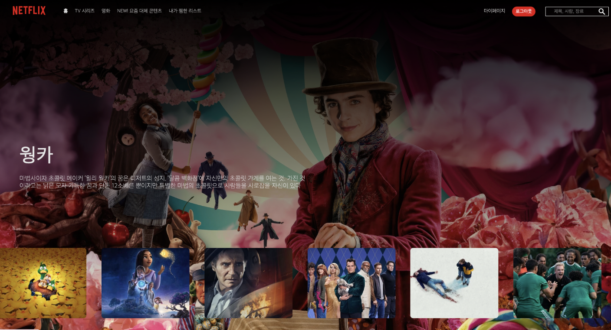

## 📌 사용 기술 스택

✓ React

✓ Typescript

✓ React Context API

✓ Redux

✓ React Query

## 구현 기능

### Login Page

아이디 : id

비밀번호 : password

👉🏻 Route의 index를 로그인 페이지로 설정하여, 로그인을 성공해야 NETFLEX 페이지에 접속가능합니다.

### Home Page

👉🏻 로그인 후 , 접속가능한 홈페이지로써 영화 클릭시, 상세정보 확인 가능합니다.

📌 React Query: 영화 정보들을 fetch하며 캐시 가능합니다.

👉🏻 좋아요 버튼 기능 구현 , 마이페이지에서 좋아요한 영화를 확인해 볼 수 있습니다.

📌 React context : 좋아요한 영화 전역상태 관리

### MyPage

마이페이지에서 개인정보를 수정할 수 있습니다. 좋아요한 영화가 없다면, section이 사라지도록 구성하였습니다.

📌 Redux : 이름, 닉네임 전역상태 관리
